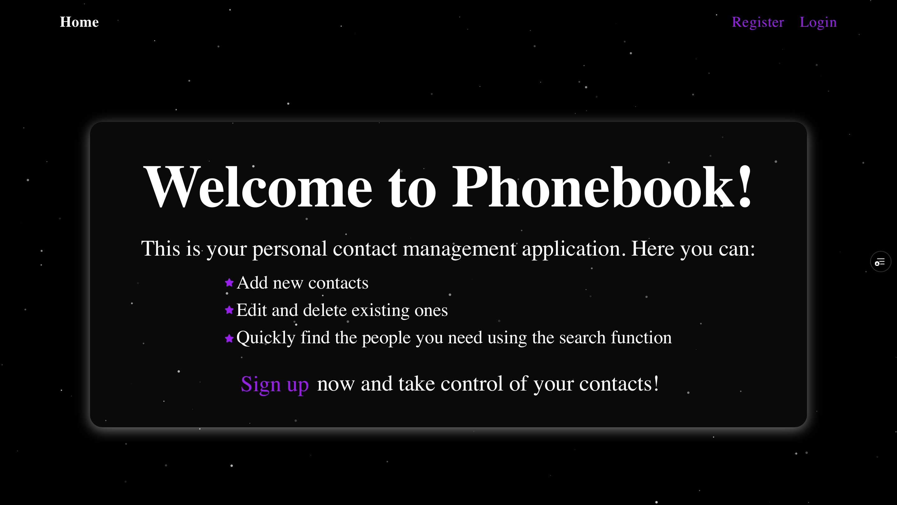

# 📞 Phonebook App

A simple and modern phonebook application built with Next.js and React. It allows users to add, edit, delete, and search contacts in a clean and responsive interface.



## ✨ Features

- ✅ Add new contacts with name and phone number
- ✅ Edit existing contacts
- ✅ Delete contacts
- ✅ Search contacts by name
- ✅ Responsive UI for desktop and mobile
- ✅ Fast and deployed on Vercel

## 🛠️ Tech Stack

- **Frontend**: [Next.js](https://nextjs.org/), [React](https://reactjs.org/), [TypeScript](https://www.typescriptlang.org/)
- **Styling**: [Tailwind CSS](https://tailwindcss.com/)
- **Components**: [ShadCN UI](https://ui.shadcn.com/) (optional)
- **State Management**: React Hooks
- **Deployment**: [Vercel](https://vercel.com/)

## 🚀 Getting Started

### Prerequisites

- Node.js ≥ 18.x
- npm / yarn / pnpm

### Installation

```bash
git clone https://github.com/your-username/phonebook.git
cd phonebook
npm install
# or
yarn
```

### Feel free to fork, contribute, or suggest improvements!
